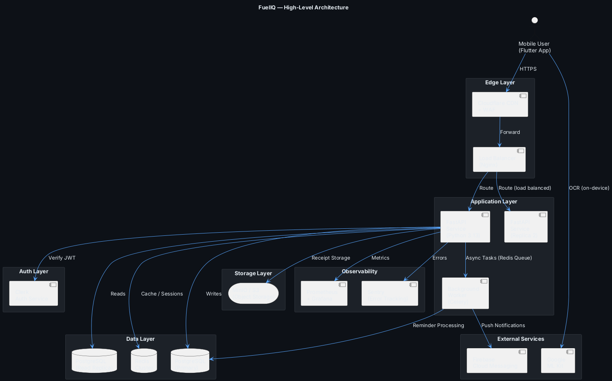
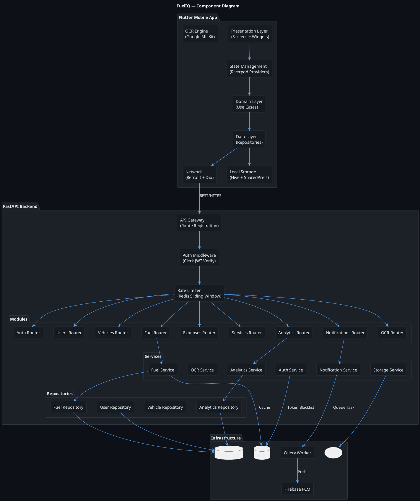
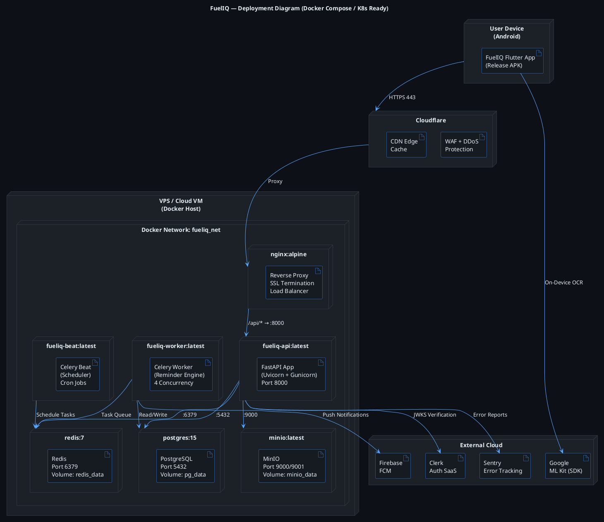
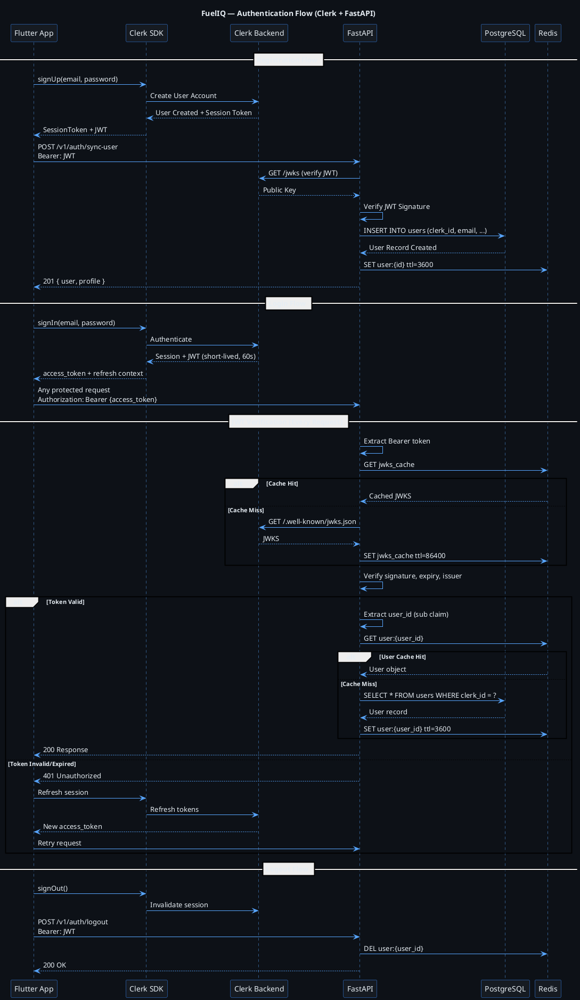
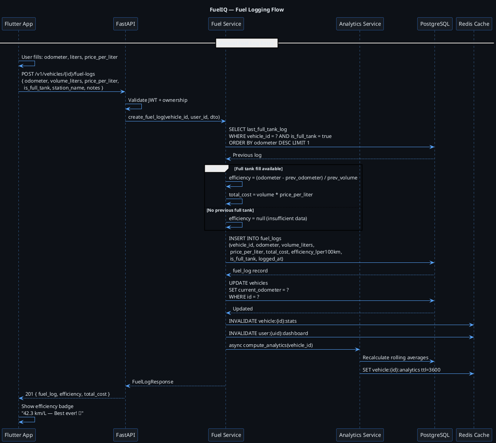
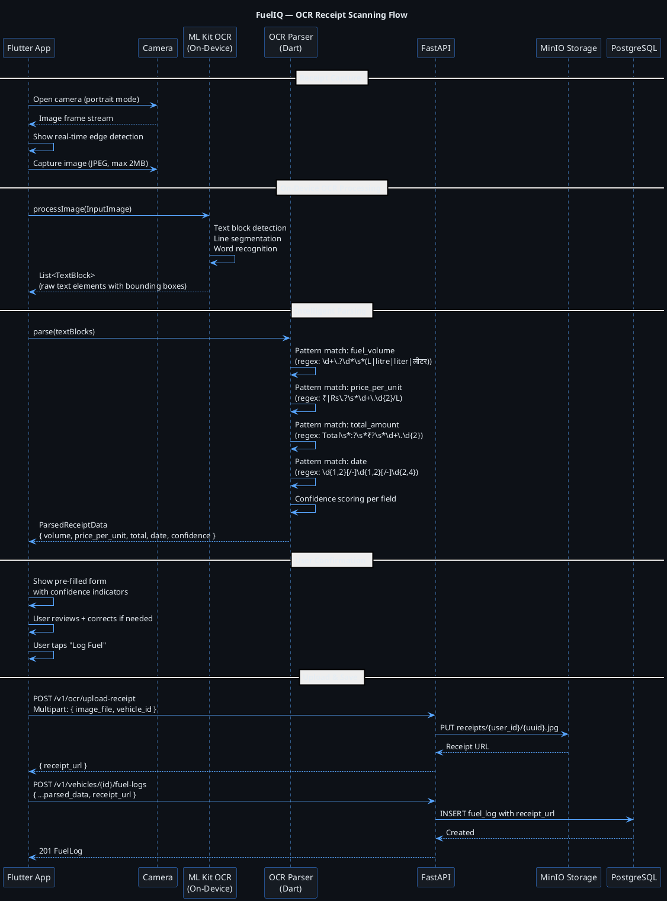
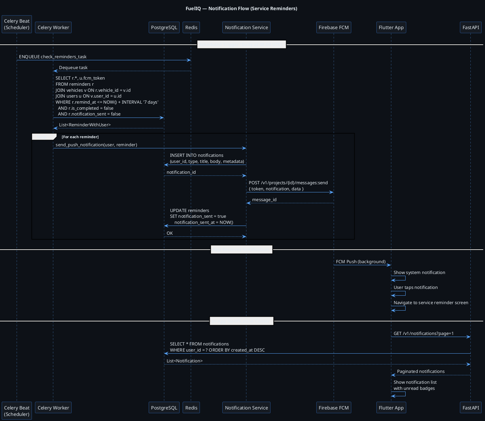

# FuelIQ — System Architecture
**Phase 2 | Version 1.0.0**

---

## 1. High-Level Architecture Overview

FuelIQ follows a **Cloud-Native Microservices-Ready Monolith** pattern for MVP — a structured monolith that can be decomposed into microservices as load demands. This is the pragmatic choice for a startup: move fast, maintain quality, defer complexity.

### Architecture Principles
1. **Stateless API Layer** — All state in DB/Redis, enabling horizontal scaling
2. **Repository Pattern** — DB access abstracted behind repositories
3. **Event-Driven Notifications** — Async notification delivery via Redis queues
4. **Defense in Depth** — Auth at gateway + per-route + per-resource level
5. **12-Factor App** — Config via env vars, logs to stdout, disposable processes

---

## 2. PlantUML Diagrams

### 2.1 High-Level Architecture

---

### 2.2 Component Diagram

---

### 2.3 Deployment Diagram

---

### 2.4 Authentication Flow

---

### 2.5 Fuel Logging Flow

---

### 2.6 OCR Flow

---

### 2.7 Notification Flow

---

## 3. Architecture Decision Records (ADRs)

### ADR-001: Structured Monolith over Microservices
**Decision**: Start with a structured monolith (FastAPI with module boundaries)
**Rationale**: At MVP scale, microservices add deployment complexity without benefits. Module boundaries are enforced through code structure, enabling extraction later.
**Tradeoff**: Single deploy unit; all modules scale together. Acceptable at < 100K users.
**Exit criteria**: Extract as independent services when any module requires independent scaling or different deployment cadence.

### ADR-002: Clerk for Authentication
**Decision**: Use Clerk as the auth provider
**Rationale**: Clerk handles all auth complexity (JWKS rotation, OAuth, MFA, session management) with a Flutter-compatible SDK. Eliminates 2-3 weeks of auth implementation risk.
**Tradeoff**: Vendor dependency, pricing at scale. Migration path: implement own OIDC server using Hydra if Clerk becomes cost-prohibitive.
**Security**: JWT verification uses Clerk's JWKS endpoint with 24h caching. Token never touches our DB — only the `sub` claim (Clerk user ID) is stored.

### ADR-003: Redis for Caching + Queue
**Decision**: Use Redis for both cache and Celery broker
**Rationale**: Reduces infrastructure components at MVP. Redis 7+ supports persistence and clustering.
**Tradeoff**: Single point of failure without Redis Cluster. Mitigated with Redis Sentinel (single AZ) at MVP, Cluster at scale.

### ADR-004: PostgreSQL with Read Replica
**Decision**: Primary + Read Replica from day one
**Rationale**: Analytics queries are read-heavy. Separating read traffic protects write performance.
**Implementation**: Writes always go to primary. Analytics/reporting queries routed to replica via SQLAlchemy connection pool.

### ADR-005: On-Device OCR (ML Kit)
**Decision**: Process OCR on-device, not via API
**Rationale**: Eliminates round-trip latency, reduces backend costs, works offline, and avoids sending raw receipt images to the server (privacy).
**Tradeoff**: OCR quality varies by device capability. Mitigation: confidence scoring, user correction flow.

---

## 4. Scalability Analysis

| Load | Strategy | Components |
|---|---|---|
| 0–1K users | Single host, Docker Compose | API × 1, PG × 1, Redis × 1 |
| 1K–10K users | Add read replica, Redis sentinel | API × 2, PG primary+replica, Redis sentinel |
| 10K–100K users | Horizontal API scaling, CDN | API × N behind LB, PG with connection pooling (PgBouncer), Redis Cluster |
| 100K–1M users | K8s, service extraction | Separate analytics service, event-driven architecture, Kafka |
| 1M+ users | Full microservices, global | Multi-region, CQRS, separate read/write models |

---

*Document Owner: Principal Architect + Senior Backend Engineer*
