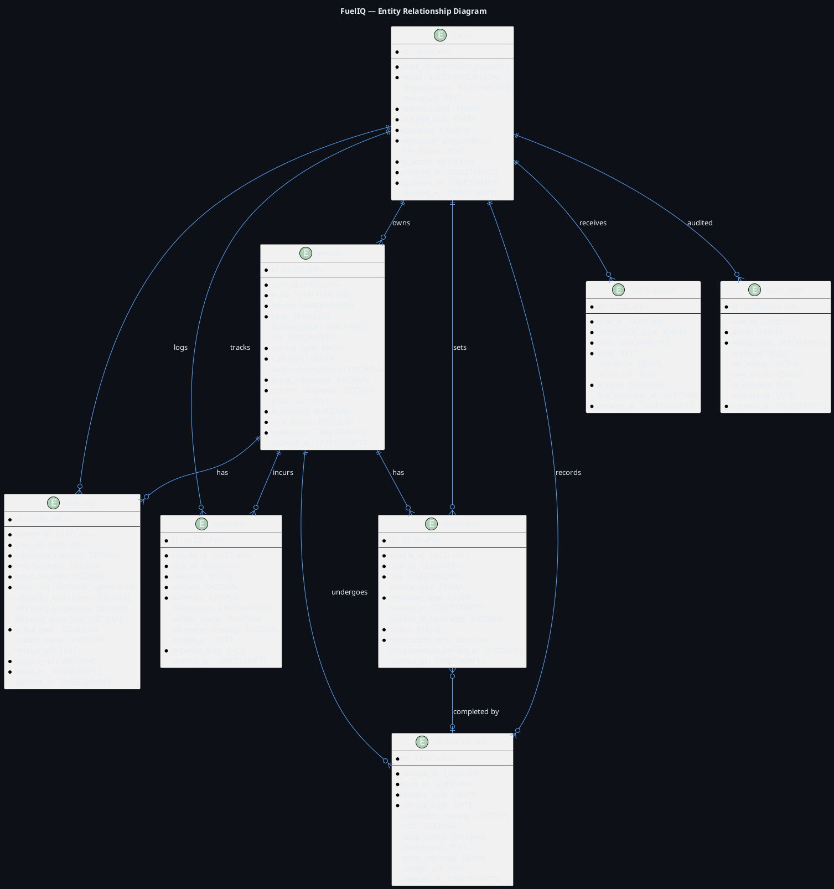

# FuelIQ — Database Design
**Phase 3 | Version 1.0.0**

---

## 1. Design Principles

- **UUID primary keys** — Globally unique, expose no sequential enumeration attack surface
- **Soft deletes** via `deleted_at` timestamp on critical tables
- **Audit trail** — Every mutation logged to `audit_logs`
- **Timezone awareness** — All timestamps in UTC (`TIMESTAMPTZ`)
- **Normalization** — 3NF with strategic denormalization for analytics read performance
- **Partitioning** — `fuel_logs` and `audit_logs` partitioned by date for long-term scale

---

## 2. PostgreSQL Schema (Full DDL)

```sql
-- ============================================================
-- EXTENSIONS
-- ============================================================
CREATE EXTENSION IF NOT EXISTS "uuid-ossp";
CREATE EXTENSION IF NOT EXISTS "pg_trgm";        -- Fuzzy text search
CREATE EXTENSION IF NOT EXISTS "btree_gist";      -- Exclusion constraints
CREATE EXTENSION IF NOT EXISTS "pg_stat_statements"; -- Query performance

-- ============================================================
-- ENUMS
-- ============================================================
CREATE TYPE fuel_type AS ENUM (
    'petrol', 'diesel', 'cng', 'electric', 'hybrid', 'lpg'
);

CREATE TYPE vehicle_type AS ENUM (
    'car', 'motorcycle', 'scooter', 'truck', 'van', 'bus', 'other'
);

CREATE TYPE expense_category AS ENUM (
    'fuel', 'maintenance', 'insurance', 'tax', 'toll',
    'parking', 'accessories', 'repair', 'cleaning', 'other'
);

CREATE TYPE service_type AS ENUM (
    'oil_change', 'tire_rotation', 'brake_service', 'air_filter',
    'fuel_filter', 'spark_plugs', 'battery', 'coolant',
    'transmission', 'general_inspection', 'ac_service',
    'wheel_alignment', 'other'
);

CREATE TYPE reminder_type AS ENUM (
    'date_based', 'odometer_based'
);

CREATE TYPE reminder_status AS ENUM (
    'pending', 'notified', 'completed', 'dismissed', 'overdue'
);

CREATE TYPE notification_type AS ENUM (
    'service_reminder', 'service_overdue', 'weekly_summary',
    'monthly_report', 'anomaly_alert', 'system'
);

CREATE TYPE distance_unit AS ENUM ('km', 'miles');
CREATE TYPE volume_unit AS ENUM ('liters', 'gallons');
CREATE TYPE currency_code AS CHAR(3);

CREATE TYPE audit_action AS ENUM (
    'INSERT', 'UPDATE', 'DELETE', 'LOGIN', 'LOGOUT',
    'EXPORT', 'VIEW_SENSITIVE'
);

-- ============================================================
-- TABLE: users
-- ============================================================
CREATE TABLE users (
    id                  UUID PRIMARY KEY DEFAULT uuid_generate_v4(),
    clerk_id            VARCHAR(255) UNIQUE NOT NULL,      -- Firebase's user ID (e.g., user_2abc...)
    email               VARCHAR(320) UNIQUE NOT NULL,
    display_name        VARCHAR(100),
    avatar_url          TEXT,
    
    -- Preferences
    distance_unit       distance_unit NOT NULL DEFAULT 'km',
    volume_unit         volume_unit NOT NULL DEFAULT 'liters',
    currency            CHAR(3) NOT NULL DEFAULT 'INR',
    timezone            VARCHAR(50) NOT NULL DEFAULT 'Asia/Kolkata',
    
    -- FCM
    fcm_token           TEXT,                              -- Firebase device token
    fcm_token_updated_at TIMESTAMPTZ,
    
    -- Soft delete + timestamps
    is_active           BOOLEAN NOT NULL DEFAULT true,
    email_verified_at   TIMESTAMPTZ,
    last_seen_at        TIMESTAMPTZ,
    created_at          TIMESTAMPTZ NOT NULL DEFAULT NOW(),
    updated_at          TIMESTAMPTZ NOT NULL DEFAULT NOW(),
    deleted_at          TIMESTAMPTZ                        -- Soft delete
);

CREATE INDEX idx_users_clerk_id ON users(clerk_id);
CREATE INDEX idx_users_email ON users(email);
CREATE INDEX idx_users_is_active ON users(is_active) WHERE is_active = true;
CREATE INDEX idx_users_deleted_at ON users(deleted_at) WHERE deleted_at IS NULL;

COMMENT ON TABLE users IS 'FuelIQ user accounts. Identity managed by Firebase; this table holds profile + preference data.';
COMMENT ON COLUMN users.clerk_id IS 'Clerk user ID, used as foreign key for JWT sub claim mapping.';

-- ============================================================
-- TABLE: vehicles
-- ============================================================
CREATE TABLE vehicles (
    id                  UUID PRIMARY KEY DEFAULT uuid_generate_v4(),
    user_id             UUID NOT NULL REFERENCES users(id) ON DELETE CASCADE,
    
    -- Identity
    make                VARCHAR(100) NOT NULL,              -- e.g., "Maruti Suzuki"
    model               VARCHAR(100) NOT NULL,              -- e.g., "Swift ZXI"
    year                SMALLINT NOT NULL 
                          CHECK (year >= 1900 AND year <= EXTRACT(YEAR FROM NOW()) + 1),
    license_plate       VARCHAR(20),
    vin                 VARCHAR(17),                        -- Vehicle Identification Number
    color               VARCHAR(50),
    
    -- Technical
    vehicle_type        vehicle_type NOT NULL DEFAULT 'car',
    fuel_type           fuel_type NOT NULL DEFAULT 'petrol',
    tank_capacity_liters DECIMAL(6,2),                     -- Full tank capacity
    
    -- Odometer
    initial_odometer    DECIMAL(10,2) NOT NULL DEFAULT 0,  -- Odometer at vehicle creation
    current_odometer    DECIMAL(10,2) NOT NULL DEFAULT 0,  -- Latest known odometer
    
    -- Media
    photo_url           TEXT,
    
    -- Status
    is_primary          BOOLEAN NOT NULL DEFAULT false,
    is_archived         BOOLEAN NOT NULL DEFAULT false,
    archived_at         TIMESTAMPTZ,
    
    -- Timestamps
    created_at          TIMESTAMPTZ NOT NULL DEFAULT NOW(),
    updated_at          TIMESTAMPTZ NOT NULL DEFAULT NOW(),
    deleted_at          TIMESTAMPTZ
);

CREATE INDEX idx_vehicles_user_id ON vehicles(user_id);
CREATE INDEX idx_vehicles_user_active ON vehicles(user_id) 
    WHERE is_archived = false AND deleted_at IS NULL;
CREATE INDEX idx_vehicles_license_plate ON vehicles(license_plate) 
    WHERE license_plate IS NOT NULL;

-- Enforce only one primary vehicle per user
CREATE UNIQUE INDEX idx_vehicles_one_primary 
    ON vehicles(user_id) WHERE is_primary = true AND deleted_at IS NULL;

COMMENT ON TABLE vehicles IS 'Vehicles owned by users. Supports multiple vehicles per user.';

-- ============================================================
-- TABLE: fuel_logs
-- ============================================================
CREATE TABLE fuel_logs (
    id                      UUID PRIMARY KEY DEFAULT uuid_generate_v4(),
    vehicle_id              UUID NOT NULL REFERENCES vehicles(id) ON DELETE CASCADE,
    user_id                 UUID NOT NULL REFERENCES users(id) ON DELETE CASCADE,
    
    -- Fill Data
    odometer_reading        DECIMAL(10,2) NOT NULL,        -- km/miles at time of fill
    volume_liters           DECIMAL(8,3) NOT NULL 
                              CHECK (volume_liters > 0),
    price_per_liter         DECIMAL(8,4) NOT NULL 
                              CHECK (price_per_liter > 0),
    total_cost              DECIMAL(10,2) NOT NULL 
                              GENERATED ALWAYS AS (volume_liters * price_per_liter) STORED,
    
    -- Computed Efficiency (nullable until second full-tank fill)
    efficiency_lper100km    DECIMAL(6,3),                  -- L/100km (lower = better)
    efficiency_kmperliter   DECIMAL(6,3),                  -- km/L (higher = better)
    distance_since_last     DECIMAL(10,2),                 -- km since previous log
    
    -- Fill metadata
    is_full_tank            BOOLEAN NOT NULL DEFAULT true,
    station_name            VARCHAR(200),
    fuel_brand              VARCHAR(100),
    
    -- Receipt
    receipt_url             TEXT,                          -- MinIO/S3 URL
    
    -- Source
    logged_via              VARCHAR(20) NOT NULL DEFAULT 'manual', -- 'manual' | 'ocr'
    ocr_confidence          DECIMAL(4,3),                  -- 0.0 to 1.0 if OCR used
    
    -- Notes
    notes                   TEXT,
    
    -- Timestamps
    filled_at               TIMESTAMPTZ NOT NULL DEFAULT NOW(),
    created_at              TIMESTAMPTZ NOT NULL DEFAULT NOW(),
    updated_at              TIMESTAMPTZ NOT NULL DEFAULT NOW(),
    deleted_at              TIMESTAMPTZ
) PARTITION BY RANGE (filled_at);

-- Partitions (create new partitions via migration as needed)
CREATE TABLE fuel_logs_2025 PARTITION OF fuel_logs
    FOR VALUES FROM ('2025-01-01') TO ('2026-01-01');
CREATE TABLE fuel_logs_2026 PARTITION OF fuel_logs
    FOR VALUES FROM ('2026-01-01') TO ('2027-01-01');
CREATE TABLE fuel_logs_2027 PARTITION OF fuel_logs
    FOR VALUES FROM ('2027-01-01') TO ('2028-01-01');

CREATE INDEX idx_fuel_logs_vehicle_id ON fuel_logs(vehicle_id, filled_at DESC);
CREATE INDEX idx_fuel_logs_user_id ON fuel_logs(user_id, filled_at DESC);
CREATE INDEX idx_fuel_logs_odometer ON fuel_logs(vehicle_id, odometer_reading DESC);
CREATE INDEX idx_fuel_logs_full_tank ON fuel_logs(vehicle_id, is_full_tank, filled_at DESC);
CREATE INDEX idx_fuel_logs_deleted ON fuel_logs(deleted_at) WHERE deleted_at IS NULL;

COMMENT ON TABLE fuel_logs IS 'Individual fuel fill records. Partitioned by year for performance.';
COMMENT ON COLUMN fuel_logs.efficiency_lper100km IS 
    'Fuel efficiency in L/100km. Calculated at insert time. NULL if insufficient data (e.g., partial fills preceding).';

-- ============================================================
-- TABLE: expenses
-- ============================================================
CREATE TABLE expenses (
    id                  UUID PRIMARY KEY DEFAULT uuid_generate_v4(),
    vehicle_id          UUID NOT NULL REFERENCES vehicles(id) ON DELETE CASCADE,
    user_id             UUID NOT NULL REFERENCES users(id) ON DELETE CASCADE,
    
    -- Expense Data
    category            expense_category NOT NULL,
    amount              DECIMAL(12,2) NOT NULL CHECK (amount > 0),
    currency            CHAR(3) NOT NULL DEFAULT 'INR',
    description         VARCHAR(500),
    vendor_name         VARCHAR(200),
    
    -- Odometer at time of expense (optional)
    odometer_reading    DECIMAL(10,2),
    
    -- Receipt
    receipt_url         TEXT,
    
    -- Date
    expense_date        DATE NOT NULL DEFAULT CURRENT_DATE,
    
    -- Timestamps
    created_at          TIMESTAMPTZ NOT NULL DEFAULT NOW(),
    updated_at          TIMESTAMPTZ NOT NULL DEFAULT NOW(),
    deleted_at          TIMESTAMPTZ
);

CREATE INDEX idx_expenses_vehicle_id ON expenses(vehicle_id, expense_date DESC);
CREATE INDEX idx_expenses_user_id ON expenses(user_id, expense_date DESC);
CREATE INDEX idx_expenses_category ON expenses(vehicle_id, category);
CREATE INDEX idx_expenses_date_range ON expenses(vehicle_id, expense_date);
CREATE INDEX idx_expenses_deleted ON expenses(deleted_at) WHERE deleted_at IS NULL;

COMMENT ON TABLE expenses IS 'Non-fuel vehicle expenses. Categories cover full lifecycle costs.';

-- ============================================================
-- TABLE: service_records
-- ============================================================
CREATE TABLE service_records (
    id                  UUID PRIMARY KEY DEFAULT uuid_generate_v4(),
    vehicle_id          UUID NOT NULL REFERENCES vehicles(id) ON DELETE CASCADE,
    user_id             UUID NOT NULL REFERENCES users(id) ON DELETE CASCADE,
    
    -- Service Data
    service_type        service_type NOT NULL,
    service_date        DATE NOT NULL,
    odometer_reading    DECIMAL(10,2),
    cost                DECIMAL(10,2),
    currency            CHAR(3) NOT NULL DEFAULT 'INR',
    
    -- Service Provider
    shop_name           VARCHAR(200),
    shop_address        TEXT,
    
    -- Details
    description         TEXT,
    parts_replaced      JSONB,                             -- [{"part": "oil filter", "brand": "Bosch"}]
    
    -- Receipt
    receipt_url         TEXT,
    
    -- Timestamps
    created_at          TIMESTAMPTZ NOT NULL DEFAULT NOW(),
    updated_at          TIMESTAMPTZ NOT NULL DEFAULT NOW(),
    deleted_at          TIMESTAMPTZ
);

CREATE INDEX idx_service_vehicle_id ON service_records(vehicle_id, service_date DESC);
CREATE INDEX idx_service_user_id ON service_records(user_id);
CREATE INDEX idx_service_type ON service_records(vehicle_id, service_type);
CREATE INDEX idx_service_deleted ON service_records(deleted_at) WHERE deleted_at IS NULL;

COMMENT ON TABLE service_records IS 'Vehicle maintenance and service history.';

-- ============================================================
-- TABLE: reminders
-- ============================================================
CREATE TABLE reminders (
    id                      UUID PRIMARY KEY DEFAULT uuid_generate_v4(),
    vehicle_id              UUID NOT NULL REFERENCES vehicles(id) ON DELETE CASCADE,
    user_id                 UUID NOT NULL REFERENCES users(id) ON DELETE CASCADE,
    
    -- Reminder config
    title                   VARCHAR(200) NOT NULL,
    description             TEXT,
    service_type            service_type,
    reminder_type           reminder_type NOT NULL DEFAULT 'date_based',
    
    -- Date-based trigger
    remind_at               TIMESTAMPTZ,                   -- For date-based reminders
    
    -- Odometer-based trigger  
    remind_at_odometer      DECIMAL(10,2),                 -- km/miles threshold
    
    -- Status
    status                  reminder_status NOT NULL DEFAULT 'pending',
    
    -- Notification tracking
    notification_sent       BOOLEAN NOT NULL DEFAULT false,
    notification_sent_at    TIMESTAMPTZ,
    
    -- Recurrence (future)
    is_recurring            BOOLEAN NOT NULL DEFAULT false,
    recurrence_interval_days INT,                          -- e.g., 90 for every 3 months
    
    -- Completion
    completed_at            TIMESTAMPTZ,
    completed_by_service_id UUID REFERENCES service_records(id),
    
    -- Timestamps
    created_at              TIMESTAMPTZ NOT NULL DEFAULT NOW(),
    updated_at              TIMESTAMPTZ NOT NULL DEFAULT NOW(),
    deleted_at              TIMESTAMPTZ
);

CREATE INDEX idx_reminders_vehicle_id ON reminders(vehicle_id);
CREATE INDEX idx_reminders_user_id ON reminders(user_id);
CREATE INDEX idx_reminders_due ON reminders(remind_at) 
    WHERE status = 'pending' AND notification_sent = false AND deleted_at IS NULL;
CREATE INDEX idx_reminders_odometer ON reminders(vehicle_id, remind_at_odometer)
    WHERE reminder_type = 'odometer_based' AND status = 'pending';
CREATE INDEX idx_reminders_status ON reminders(user_id, status);

COMMENT ON TABLE reminders IS 'Service reminders. Supports date-based and odometer-based triggers.';

-- ============================================================
-- TABLE: notifications
-- ============================================================
CREATE TABLE notifications (
    id                  UUID PRIMARY KEY DEFAULT uuid_generate_v4(),
    user_id             UUID NOT NULL REFERENCES users(id) ON DELETE CASCADE,
    
    -- Content
    notification_type   notification_type NOT NULL,
    title               VARCHAR(200) NOT NULL,
    body                TEXT NOT NULL,
    
    -- Related entity (polymorphic reference via JSONB)
    metadata            JSONB,                             -- { "reminder_id": "...", "vehicle_id": "..." }
    
    -- Deep link for app navigation
    action_url          TEXT,                              -- e.g., "/garage/vehicle-id/reminders/reminder-id"
    
    -- State
    is_read             BOOLEAN NOT NULL DEFAULT false,
    read_at             TIMESTAMPTZ,
    
    -- FCM delivery
    fcm_message_id      VARCHAR(200),
    delivered_at        TIMESTAMPTZ,
    
    -- Timestamps
    created_at          TIMESTAMPTZ NOT NULL DEFAULT NOW()
);

CREATE INDEX idx_notifications_user_id ON notifications(user_id, created_at DESC);
CREATE INDEX idx_notifications_unread ON notifications(user_id, is_read) 
    WHERE is_read = false;

-- Retain notifications for 90 days, auto-cleanup via pg_cron (future)
CREATE INDEX idx_notifications_created ON notifications(created_at);

COMMENT ON TABLE notifications IS 'In-app notification records. FCM push status tracked here.';

-- ============================================================
-- TABLE: audit_logs
-- ============================================================
CREATE TABLE audit_logs (
    id              BIGSERIAL,                             -- BIGSERIAL for high volume
    user_id         UUID REFERENCES users(id) ON DELETE SET NULL,
    
    -- Action
    action          audit_action NOT NULL,
    entity_type     VARCHAR(50) NOT NULL,                  -- 'fuel_log', 'vehicle', etc.
    entity_id       UUID,
    
    -- Change tracking
    old_values      JSONB,                                 -- Before state
    new_values      JSONB,                                 -- After state
    
    -- Request context
    ip_address      INET,
    user_agent      VARCHAR(500),
    request_id      UUID,
    
    -- Timestamp
    created_at      TIMESTAMPTZ NOT NULL DEFAULT NOW(),
    
    PRIMARY KEY (id, created_at)
) PARTITION BY RANGE (created_at);

-- Monthly partitions for audit logs (high volume)
CREATE TABLE audit_logs_2026_01 PARTITION OF audit_logs
    FOR VALUES FROM ('2026-01-01') TO ('2026-02-01');
CREATE TABLE audit_logs_2026_02 PARTITION OF audit_logs
    FOR VALUES FROM ('2026-02-01') TO ('2026-03-01');
CREATE TABLE audit_logs_2026_03 PARTITION OF audit_logs
    FOR VALUES FROM ('2026-03-01') TO ('2026-04-01');
CREATE TABLE audit_logs_2026_04 PARTITION OF audit_logs
    FOR VALUES FROM ('2026-04-01') TO ('2026-05-01');
CREATE TABLE audit_logs_2026_05 PARTITION OF audit_logs
    FOR VALUES FROM ('2026-05-01') TO ('2026-06-01');
CREATE TABLE audit_logs_2026_06 PARTITION OF audit_logs
    FOR VALUES FROM ('2026-06-01') TO ('2026-07-01');
CREATE TABLE audit_logs_2026_07 PARTITION OF audit_logs
    FOR VALUES FROM ('2026-07-01') TO ('2026-08-01');
CREATE TABLE audit_logs_2026_08 PARTITION OF audit_logs
    FOR VALUES FROM ('2026-08-01') TO ('2026-09-01');
CREATE TABLE audit_logs_2026_09 PARTITION OF audit_logs
    FOR VALUES FROM ('2026-09-01') TO ('2026-10-01');
CREATE TABLE audit_logs_2026_10 PARTITION OF audit_logs
    FOR VALUES FROM ('2026-10-01') TO ('2026-11-01');
CREATE TABLE audit_logs_2026_11 PARTITION OF audit_logs
    FOR VALUES FROM ('2026-11-01') TO ('2026-12-01');
CREATE TABLE audit_logs_2026_12 PARTITION OF audit_logs
    FOR VALUES FROM ('2026-12-01') TO ('2027-01-01');

CREATE INDEX idx_audit_logs_user_id ON audit_logs(user_id, created_at DESC);
CREATE INDEX idx_audit_logs_entity ON audit_logs(entity_type, entity_id, created_at DESC);
CREATE INDEX idx_audit_logs_action ON audit_logs(action, created_at DESC);

COMMENT ON TABLE audit_logs IS 'Immutable audit trail. Monthly partitioned. Never soft-deleted.';

-- ============================================================
-- TRIGGERS: updated_at auto-management
-- ============================================================
CREATE OR REPLACE FUNCTION update_updated_at_column()
RETURNS TRIGGER AS $$
BEGIN
    NEW.updated_at = NOW();
    RETURN NEW;
END;
$$ LANGUAGE plpgsql;

CREATE TRIGGER trg_users_updated_at
    BEFORE UPDATE ON users
    FOR EACH ROW EXECUTE FUNCTION update_updated_at_column();

CREATE TRIGGER trg_vehicles_updated_at
    BEFORE UPDATE ON vehicles
    FOR EACH ROW EXECUTE FUNCTION update_updated_at_column();

CREATE TRIGGER trg_expenses_updated_at
    BEFORE UPDATE ON expenses
    FOR EACH ROW EXECUTE FUNCTION update_updated_at_column();

CREATE TRIGGER trg_service_records_updated_at
    BEFORE UPDATE ON service_records
    FOR EACH ROW EXECUTE FUNCTION update_updated_at_column();

CREATE TRIGGER trg_reminders_updated_at
    BEFORE UPDATE ON reminders
    FOR EACH ROW EXECUTE FUNCTION update_updated_at_column();

-- ============================================================
-- VIEWS: Useful analytics views
-- ============================================================

-- Vehicle summary stats (materialized for performance)
CREATE MATERIALIZED VIEW vehicle_stats AS
SELECT
    v.id AS vehicle_id,
    v.user_id,
    v.make,
    v.model,
    
    -- Fuel stats
    COUNT(DISTINCT fl.id) AS total_fuel_logs,
    COALESCE(SUM(fl.volume_liters), 0) AS total_liters_filled,
    COALESCE(SUM(fl.total_cost), 0) AS total_fuel_cost,
    AVG(fl.efficiency_lper100km) FILTER (WHERE fl.efficiency_lper100km IS NOT NULL) AS avg_efficiency_lper100km,
    
    -- Expense stats
    COALESCE(SUM(e.amount), 0) AS total_expense_cost,
    
    -- Service stats
    COUNT(DISTINCT sr.id) AS total_service_records,
    COALESCE(SUM(sr.cost), 0) AS total_service_cost,
    MAX(sr.service_date) AS last_service_date,
    
    -- Total cost of ownership
    COALESCE(SUM(fl.total_cost), 0) + COALESCE(SUM(e.amount), 0) + COALESCE(SUM(sr.cost), 0) AS total_cost_of_ownership,
    
    -- Distance
    v.current_odometer - v.initial_odometer AS total_distance_km,
    
    -- Last activity
    GREATEST(MAX(fl.filled_at), MAX(e.created_at), MAX(sr.created_at)) AS last_activity_at
    
FROM vehicles v
LEFT JOIN fuel_logs fl ON fl.vehicle_id = v.id AND fl.deleted_at IS NULL
LEFT JOIN expenses e ON e.vehicle_id = v.id AND e.deleted_at IS NULL
LEFT JOIN service_records sr ON sr.vehicle_id = v.id AND sr.deleted_at IS NULL
WHERE v.deleted_at IS NULL
GROUP BY v.id, v.user_id, v.make, v.model, v.current_odometer, v.initial_odometer;

CREATE UNIQUE INDEX idx_vehicle_stats_vehicle_id ON vehicle_stats(vehicle_id);

-- Refresh materialized view function
CREATE OR REPLACE FUNCTION refresh_vehicle_stats()
RETURNS void AS $$
BEGIN
    REFRESH MATERIALIZED VIEW CONCURRENTLY vehicle_stats;
END;
$$ LANGUAGE plpgsql;

COMMENT ON MATERIALIZED VIEW vehicle_stats IS 
    'Pre-computed vehicle statistics. Refreshed via Celery task after fuel/expense/service mutations.';
```

---

## 3. ER Diagram



---

## 4. Index Strategy

| Table | Index | Type | Reason |
|---|---|---|---|
| users | clerk_id | UNIQUE BTREE | JWT sub → user lookup (every request) |
| users | email | UNIQUE BTREE | Login lookup |
| vehicles | (user_id, active) | Partial BTREE | Garage list query |
| fuel_logs | (vehicle_id, filled_at DESC) | BTREE | History pagination |
| fuel_logs | (vehicle_id, is_full_tank, filled_at DESC) | BTREE | Efficiency calculation |
| expenses | (vehicle_id, expense_date) | BTREE | Date range analytics |
| reminders | remind_at (pending only) | Partial BTREE | Celery reminder scan |
| audit_logs | (user_id, created_at) | BTREE | Compliance queries |
| vehicle_stats | vehicle_id | UNIQUE (mat. view) | Dashboard lookups |

---

## 5. SQL Migrations (Alembic Format)

```python
# migrations/versions/001_initial_schema.py
"""Initial FuelIQ Schema

Revision ID: 001_initial_schema
Revises: None
Create Date: 2026-06-01

"""
from alembic import op
import sqlalchemy as sa
from sqlalchemy.dialects import postgresql

revision = '001_initial_schema'
down_revision = None
branch_labels = None
depends_on = None


def upgrade() -> None:
    # Execute the full DDL from above
    op.execute("""
        CREATE EXTENSION IF NOT EXISTS "uuid-ossp";
        CREATE EXTENSION IF NOT EXISTS "pg_trgm";
        CREATE EXTENSION IF NOT EXISTS "btree_gist";
    """)
    
    # Create ENUMS
    op.execute("""
        CREATE TYPE fuel_type AS ENUM (
            'petrol', 'diesel', 'cng', 'electric', 'hybrid', 'lpg'
        );
        CREATE TYPE vehicle_type AS ENUM (
            'car', 'motorcycle', 'scooter', 'truck', 'van', 'bus', 'other'
        );
        CREATE TYPE expense_category AS ENUM (
            'fuel', 'maintenance', 'insurance', 'tax', 'toll',
            'parking', 'accessories', 'repair', 'cleaning', 'other'
        );
        CREATE TYPE service_type AS ENUM (
            'oil_change', 'tire_rotation', 'brake_service', 'air_filter',
            'fuel_filter', 'spark_plugs', 'battery', 'coolant',
            'transmission', 'general_inspection', 'ac_service',
            'wheel_alignment', 'other'
        );
        CREATE TYPE reminder_type AS ENUM ('date_based', 'odometer_based');
        CREATE TYPE reminder_status AS ENUM (
            'pending', 'notified', 'completed', 'dismissed', 'overdue'
        );
        CREATE TYPE notification_type AS ENUM (
            'service_reminder', 'service_overdue', 'weekly_summary',
            'monthly_report', 'anomaly_alert', 'system'
        );
        CREATE TYPE distance_unit AS ENUM ('km', 'miles');
        CREATE TYPE volume_unit AS ENUM ('liters', 'gallons');
        CREATE TYPE audit_action AS ENUM (
            'INSERT', 'UPDATE', 'DELETE', 'LOGIN', 'LOGOUT',
            'EXPORT', 'VIEW_SENSITIVE'
        );
    """)
    
    # Create tables (using the full DDL defined above)
    # ... (full DDL executed here)


def downgrade() -> None:
    op.execute("DROP MATERIALIZED VIEW IF EXISTS vehicle_stats;")
    op.execute("DROP TABLE IF EXISTS audit_logs CASCADE;")
    op.execute("DROP TABLE IF EXISTS notifications CASCADE;")
    op.execute("DROP TABLE IF EXISTS reminders CASCADE;")
    op.execute("DROP TABLE IF EXISTS service_records CASCADE;")
    op.execute("DROP TABLE IF EXISTS expenses CASCADE;")
    op.execute("DROP TABLE IF EXISTS fuel_logs CASCADE;")
    op.execute("DROP TABLE IF EXISTS vehicles CASCADE;")
    op.execute("DROP TABLE IF EXISTS users CASCADE;")
    op.execute("""
        DROP TYPE IF EXISTS audit_action;
        DROP TYPE IF EXISTS notification_type;
        DROP TYPE IF EXISTS reminder_status;
        DROP TYPE IF EXISTS reminder_type;
        DROP TYPE IF EXISTS service_type;
        DROP TYPE IF EXISTS expense_category;
        DROP TYPE IF EXISTS vehicle_type;
        DROP TYPE IF EXISTS fuel_type;
        DROP TYPE IF EXISTS distance_unit;
        DROP TYPE IF EXISTS volume_unit;
    """)
```

---

## 6. Data Access Patterns & Query Examples

### Hot Path: Dashboard Load
```sql
-- Single query for user dashboard (< 5ms target)
SELECT
    vs.vehicle_id,
    v.make, v.model, v.year, v.photo_url,
    vs.total_liters_filled,
    vs.total_fuel_cost,
    vs.avg_efficiency_lper100km,
    vs.total_cost_of_ownership,
    vs.total_distance_km,
    vs.last_service_date,
    (SELECT COUNT(*) FROM reminders r 
     WHERE r.vehicle_id = v.id 
       AND r.status IN ('pending', 'overdue')
       AND r.deleted_at IS NULL) AS pending_reminders
FROM vehicles v
JOIN vehicle_stats vs ON vs.vehicle_id = v.id
WHERE v.user_id = $1
  AND v.is_archived = false
  AND v.deleted_at IS NULL
ORDER BY v.is_primary DESC, v.created_at ASC;
```

### Analytics: Monthly Fuel Cost Trend
```sql
-- 12-month fuel cost trend per vehicle
SELECT
    DATE_TRUNC('month', fl.filled_at) AS month,
    SUM(fl.total_cost) AS total_cost,
    SUM(fl.volume_liters) AS total_liters,
    AVG(fl.efficiency_lper100km) AS avg_efficiency,
    COUNT(*) AS fill_count
FROM fuel_logs fl
WHERE fl.vehicle_id = $1
  AND fl.filled_at >= NOW() - INTERVAL '12 months'
  AND fl.deleted_at IS NULL
GROUP BY DATE_TRUNC('month', fl.filled_at)
ORDER BY month ASC;
```

---

## 7. Tradeoffs & Production Considerations

| Decision | Tradeoff | Mitigation |
|---|---|---|
| UUID PKs | Slightly larger index size vs INT | Acceptable; gains: security, distributed generation |
| Table partitioning | Increased DDL complexity | Managed via Alembic; operational benefit exceeds cost at scale |
| Materialized view for stats | Stale data (seconds) | Celery task refreshes after every mutation; acceptable staleness |
| JSONB for metadata | Less query-able than columns | Indexed JSONB operators; used only for flexible, rarely-queried data |
| Soft deletes | Data accumulates | Archival job (pg_cron) hard-deletes soft-deleted records after 90 days |
| Generated column total_cost | Cannot be directly inserted | Client never sends total_cost; always computed server-side |

*Document Owner: Senior Database Architect*
