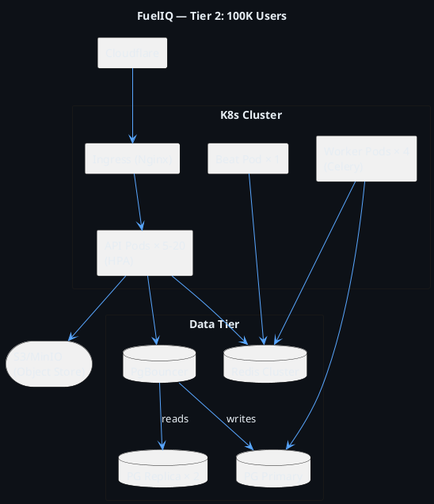

# FuelIQ — Phase 16: Future Scale Architecture
**Version 1.0 | Scaling Playbook**

---

## 1. Current State (MVP — 0 to 1,000 Users)

```
Single VPS → Nginx → FastAPI × 1 → PostgreSQL × 1 → Redis × 1 → MinIO
```

**Characteristics:**
- All services on one Docker host
- Single PostgreSQL instance (no replication)
- Single Redis instance
- Monthly cost: ~$40–80/month (Digital Ocean Droplet 4GB)

---

## 2. Scaling Timeline

### Tier 1: 1K → 10K Users (Growth Stage)

**Trigger signals:**
- API P95 > 300ms
- PostgreSQL connections > 80% of max
- CPU consistently > 60%

**Changes:**

| Component | Change | Why |
|---|---|---|
| FastAPI | Scale to 2–3 replicas | Horizontal CPU distribution |
| PostgreSQL | Add read replica | Separate analytics from write path |
| Redis | Add Redis Sentinel | HA without full cluster overhead |
| Storage | Move MinIO to dedicated VM | Isolate IO from compute |
| CDN | Add Cloudflare | Cache static responses, DDoS protection |

**Architecture:**
```
Cloudflare CDN → Load Balancer (Nginx/HAProxy)
                   ├── FastAPI × 3
                   │     ├── PostgreSQL Primary (writes)
                   │     ├── PostgreSQL Replica (reads/analytics)
                   │     └── Redis Sentinel (cache/queue)
                   └── MinIO (dedicated node)
```

**Monthly cost estimate:** ~$200–400/month

---

### Tier 2: 10K → 100K Users (Scale Stage)

**Trigger signals:**
- Need for zero-downtime deploys at scale
- Multiple regions required
- Analytics queries impacting write performance

**Changes:**

#### Database
- **PgBouncer** connection pooler in front of PostgreSQL
  - Prevents connection exhaustion (PostgreSQL max_connections is expensive)
  - Transaction pooling mode: 1 physical connection serves 10× logical connections
- **PostgreSQL read replica** x2 (analytics + reporting on separate replica)
- **Partitioned tables** already in schema — now actively maintained
- **pg_cron** extension for automatic old partition pruning

#### Application
- **Kubernetes (K8s)** deployment — Docker Compose → Helm charts
- **Horizontal Pod Autoscaler (HPA)** on API pods (CPU/RPS based)
- **Pod Disruption Budgets** for rolling updates without downtime
- **Resource quotas and limits** enforced per namespace

#### Cache
- **Redis Cluster** (3 primary + 3 replica nodes)
- Separate Redis instance per concern: cache, queue, session
- **Cache warming** on startup: pre-load JWKS, common vehicle stats

#### Analytics
- **Dedicated analytics worker** — separate Celery queue + worker pod
- **Materialized views** refreshed every 5 minutes via Celery beat
- **Read-only analytics endpoint** always served from read replica



**Monthly cost estimate:** ~$1,500–3,000/month

---

### Tier 3: 100K → 1M Users (Enterprise Stage)

**Changes:**

#### Service Decomposition
Extract the analytics module as an independent service:

```
fueliq-api/           → Remains: auth, CRUD operations
fueliq-analytics/     → Extracted: all analytics queries, ML predictions
fueliq-notifications/ → Extracted: FCM, notification scheduling
fueliq-ocr/           → Extracted: if server-side OCR added
```

**Why decompose?**
- Analytics is read-heavy → scale independently with more read replicas
- Notifications have different SLA (eventual delivery OK) → cheaper infrastructure
- Allows separate deployment cadences

#### Event-Driven Architecture
```
API → Kafka → Analytics Consumer (real-time)
           → Notification Consumer (async)
           → Audit Consumer (compliance)
```

**Kafka topics:**
- `fuel-log.created` → triggers analytics recompute
- `reminder.due` → triggers notification send
- `user.activity` → triggers last_seen update (fire-and-forget)

This removes synchronous coupling — fuel log creation returns in <50ms regardless of downstream processing.

#### Database CQRS
```
Write DB (PostgreSQL primary)
  → Kafka Change Data Capture (Debezium)
    → Read Model (PostgreSQL read-optimized schema)
    → Analytics DB (ClickHouse for time-series aggregation)
```

**Why ClickHouse for analytics at this scale?**
- PostgreSQL struggles with GROUP BY + time-window queries at 10M+ rows
- ClickHouse compresses and queries time-series 100× faster
- MergeTree engine with custom ordering by `(vehicle_id, filled_at)`

#### CDN & Edge Caching
- **Cloudflare R2** for receipt/avatar storage (no egress fees)
- **Cloudflare Cache Rules** for analytics responses (5-min TTL)
- **Edge Workers** for auth token validation (reduce origin hits)

**Monthly cost estimate:** ~$8,000–20,000/month

---

### Tier 4: 1M → 10M Users (Global Scale)

#### Multi-Region Active-Active
```
Region: ap-south-1 (India — primary)
Region: us-east-1 (USA — secondary)
Region: eu-west-1 (Europe — secondary)
```

**Data strategy:**
- User data stays in user's region (GDPR compliance)
- Clerk handles auth globally (their edge infrastructure)
- Analytics aggregated globally for product insights (anonymized)

#### Database Sharding Strategy
```
Sharding key: user_id (hash-based)
  Shard 0: user_id % 4 == 0 → DB Cluster A (India users)
  Shard 1: user_id % 4 == 1 → DB Cluster B (US users)
  Shard 2: user_id % 4 == 2 → DB Cluster C (EU users)
  Shard 3: user_id % 4 == 3 → DB Cluster D (overflow)
```

**Tools:** Citus (PostgreSQL sharding extension) or Vitess (MySQL-compatible)

#### Global State Architecture
```
Global:
  - User account (Firebase — their SaaS handles global auth)
  - Fleet/subscription data (replicated to all regions)

Regional:
  - Vehicle data
  - Fuel logs
  - Expenses
  - Analytics
```

---

## 3. Bottleneck Analysis

| Load | Primary Bottleneck | Solution |
|---|---|---|
| 1K users | None | Monitor |
| 10K users | DB connections | PgBouncer connection pooling |
| 50K users | API CPU | K8s HPA, more API pods |
| 100K users | Analytics query time | Dedicated analytics service, ClickHouse |
| 500K users | DB write throughput | PG Cluster, write partitioning |
| 1M users | Single-region latency | Multi-region, CDN edge |
| 10M users | Data gravity | Sharding, CQRS, eventual consistency |

---

## 4. Caching Strategy by Layer

```
Layer 1: Client (Flutter)
  - Hive local DB: vehicle list, last 20 fuel logs
  - SharedPreferences: user preferences
  - TTL: Until user action or app foreground

Layer 2: CDN (Cloudflare)
  - Cache: GET /api/v1/vehicles/{id}/analytics (5 min TTL)
  - Cache: Static assets (font files, Lottie animations)
  - Bypass: All POST/PUT/DELETE, all authenticated list queries

Layer 3: Redis (Application Cache)
  - JWKS: 24h TTL (Clerk public keys don't rotate often)
  - User profile: 1h TTL, invalidated on profile update
  - Vehicle stats (materialized view): 5 min TTL
  - Analytics summaries: 1h TTL, invalidated on any mutation
  - Rate limit counters: 60s sliding window

Layer 4: PostgreSQL (Materialized Views)
  - vehicle_stats: Refreshed every 5 min via Celery
  - Never used for real-time queries — only dashboard "snapshot"

Layer 5: ClickHouse (Analytics Layer, Tier 3+)
  - Pre-aggregated monthly stats
  - Sub-second query response at 10M+ rows
```

---

## 5. Monitoring & Observability Stack

| Tool | Purpose | Alert on |
|---|---|---|
| Prometheus | Metrics collection | API P95 > 500ms |
| Grafana | Dashboards | Worker queue depth > 1000 |
| Sentry | Error tracking | Error rate > 1% |
| PgBouncer stats | DB connection health | Pool saturation > 80% |
| Redis INFO | Cache hit ratio | Hit ratio < 70% |
| Celery Flower | Task monitoring | Failed tasks > 10/min |

**Key SLIs/SLOs:**

| SLI | Measurement | SLO Target |
|---|---|---|
| API Availability | HTTP 2xx/total | 99.9% |
| API Latency | P95 response time | < 200ms |
| Fuel Log Creation | End-to-end success rate | > 99.5% |
| Push Notification Delivery | Delivered/attempted | > 95% |
| OCR Confidence | Fields extracted > 0.75 | > 85% of scans |

---

## 6. Security Scaling Considerations

| Scale | Security Concern | Solution |
|---|---|---|
| 10K users | DDoS attacks increase | Cloudflare Magic Transit |
| 50K users | Account takeover attempts | Clerk MFA enforcement, anomaly detection |
| 100K users | PII data volume | Column-level encryption for PII in PostgreSQL |
| 1M users | Regulatory compliance (GDPR/PDPB) | Data residency enforcement, right-to-erasure pipeline |
| 10M users | Insider threat | Vault for secrets, audit log streaming to SIEM |

---

## 7. Cost Optimization Strategy

| Stage | Technique | Savings |
|---|---|---|
| All stages | Reserved instances (1yr) | 30–40% |
| 10K+ users | Spot instances for Celery workers | 60–80% on worker compute |
| 50K+ users | Tiered storage (cold receipts to Glacier) | 90% on old receipt storage |
| 100K+ users | Analytics on read replica (no separate compute) | $500–1000/month |
| 1M+ users | CDN caching of analytics (reduce DB reads) | 40% DB cost reduction |

---

*Document Owner: Principal Architect + Senior DevOps Engineer*
*Review Trigger: When user count crosses 10K, 100K, 1M thresholds*
